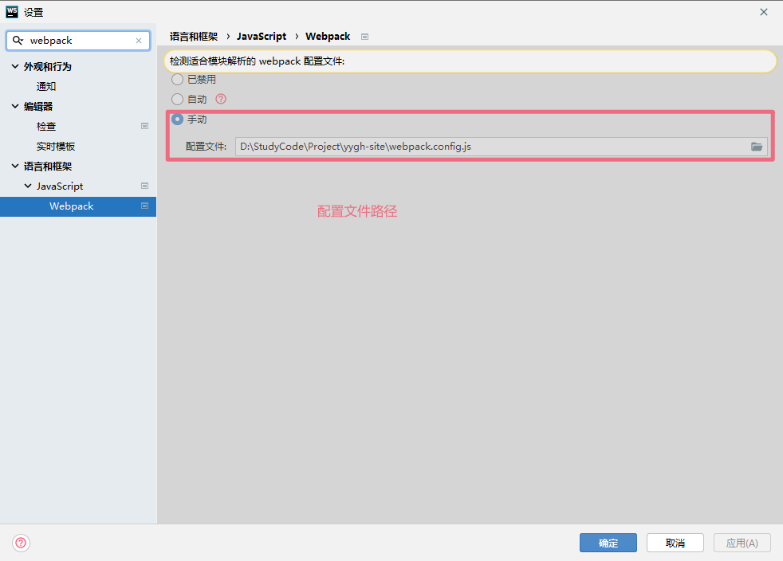
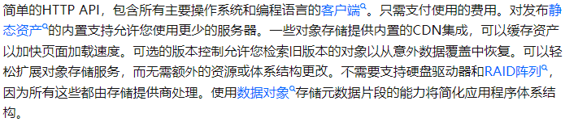

# 项目介绍

简介：基于 SpringCloudAlibaba + SpringCloud + Vue 实现 **前(后)台** 医院预约挂号系统

学习视频：https://www.bilibili.com/video/BV1V5411K7rT

仓库地址：https://github.com/Dreamer-07/yygh

技术点：

- 前台系统使用 Vue + ElementUI + Axios 采用前后端分离；后台系统使用 Nuxt 服务端渲染技术(SSR)实现

- 通过 **自定义注解** 实现 `MybatisPlus Dynamic QueryWrapper`，只需要在条件对象的属性上配置注解，即可自动拼接 QW 实现查询 

- 通过 SpringBoot 整合 **EasyExcel** 实现对 Excel 文件的便捷操作

- 使用 **Redis** 作为项目缓存中间件，减小数据库压力

- 学习 **Docker** 安装中间件技术(`Redis + MongoDB`)

  > 虽然在本项目中学习并使用了 MongoDB，但感觉并不适合本项目(完全可以使用 Mysql 代替)，出于学习目的还是使用了

- 通过 **容联云短信服务**  代替 **阿里云服务**(不支持个人认证) 实现手机验证码登录

- 采用 **JWT** 作为令牌存储技术，实现前后端通信，同时配置 **Gateway Global Filter** 进行统一拦截

- 学习 **OAuth2**，使用其中的 `Authorization code` (授权码模式) 接入微信平台实现社交登录

- 使用 **RabbitMQ** 实现**服务解耦**和**异步通信**，提高系统的吞吐量

- 使用 SpringBoot Task 实现**每日定时就医通知**

- 简单了解 **Echarts** 使用其完成 **统计医院每日订单数量** 的图表展示

# 前端

## Babel & Webpack

### Babel

一些 ES6 的语法在某些游览器环境甚至在 Node.js 中都无法运行，这时候就需要将 ES6 的语法转换成 ES5 的语法，从而可以在现有环境中执行

> babel 安装

打开 cmd 命令行，输入：

```powershell
npm install -g babel-cli
```

> babel 使用

1. 初始化项目

   ```powershell
   npm init -y
   ```

2. 创建 `src/source.js` 文件

   ```javascript
   let name = "巴御前天下第一";
   let arr = [1, 2, 3, 4, 5, 7];
   let newarr = arr.map(item => item * 2);
   console.log(name);
   console.log(newarr);
   ```

3. 在根目录下创建 `.babelrc`,设置转码规则和插件，这里设置转码规则为 **es2015**

   ```json
   {
       "presets": ["es2015"],
       "plugins"" []
   }
   ```

4. 安装需要使用的转码器

   ```powershell
   npm install --save-dev babel-preset-es2015
   ```

5. 进行相关转码命令

   ```powershell
   mkdir dist
   # 编译指定文件
   babel src/source.js --out-file dist/compiled.js
   babel src/source.js -o dist/compiled.js
   
   # 编译整个目录
   babel src -d dist2
   babel src --out-dir dist2
   ```

6. 查看编译后的文件

   ```javascript
   "use strict";
   
   var name = "巴御前天下第一";
   var arr = [1, 2, 3, 4, 5, 7];
   var newarr = arr.map(function (item) {
       return item * 2;
   });
   console.log(name);
   console.log(newarr);
   ```

> 自定义脚本

1. 修改 `package.json`

   ```json
   {
       ...
       "scripts": {
           ...
           "build": "babel src -d dist"
       },
   }
   ```

2. 在根目录打开 cmd，输入 `npm run build`

3. 查看 dist 文件夹

### Webpack

> 简介

**Webpack** 是一个前端资源**加载/打包**工具，可以根据模块的依赖关系进行静态分析，然后将这些模块按照指定的规则生成对应的静态资源


> 安装

1. 通过 `npm` 安装

   ```shell
   npm install -g webpack webpack-cli
   ```

2. 查看版本号

   ```shell
   webpack -v
   ```

> 合并 JS 文件

1. 初始化项目

   ```powershell
   npm init -y
   ```

2. 在 `src/` 下创建两个 js 文件

   ```javascript
   exports.write = (str) => {
       document.write(str);
   } 
   ```

   ```javascript
   exports.add = (a , b) => {
       return a + b;
   }
   ```

3. 在 `src/` 下创建 `main.js`

   ```javascript
   const util01 = require('./01');
   const util02 = require('./02');
   
   util01.write('hello' + util02.add(1, 2));
   ```

4. 在根目录下创建配置文件，文件名固定为 **webpack.config.js**

   ```js
   const path = require("path")
   module.exports = {
       entry: './src/main.js', // 配置入口文件
       output: {
           path: path.resolve(__dirname, './dist'), // 配置输出路径
           filename: 'bundle.js' // 配置输出文件
       }
   }
   ```

5. 执行打包命令

   ```powershell
   webpack --mode=development
   ```

6. 创建 `index.html`引入 `dist/bundle.js` 后打开页面查看输出

> 合并 CSS 文件

1. 安装相关 loader 插件，`css-loader` 复制将 css 装载到 js 中，`style-loader` 是让 js 认识 css

   ```powershell
   npm install -D style-loader css-loader
   ```

2. 修改 `webpack.config.js` 文件

   ```js
   const path = require("path")
   module.exports = {
       entry: './src/main.js', // 配置入口文件
       output: {
           ...
       },
       module: {
           rules: [
               {
                   test: /\.css$/, // 匹配 css 文件
                   use: ['style-loader', 'css-loader'] // 使用的插件
               }
           ]
       }
   }
   ```

3. 在 `src/` 文件下创建 style.css

   ```css
   body {
       background-color: rgba(255, 49, 49, 0.651);
   }
   ```

4. 在 `main.js` 中引入

   ```javascript
   require('./style.css')
   ```

5. 重新执行打包命令

   ```powershell
   webpack --mode=development
   ```

6. 重新打开页面

## Vue 组件重用问题

当 `vue-router` 进行路由切换时，如果渲染的是同一个组件，那么组件中的生命周期函数 `created()` / `mounted()` 只会执行一遍

解决方案：可以在对应的 `router-view` 上加上一个唯一的 **key** 。保存路由切换时都会重新触发生命周期函数

```vue
<router-view :key="key"></router-view>

<script>
export default {
  computed: {
    key() {
      return this.$route.name !== undefined ? this.$route.name + +new Date() : this.$route + +new Date()
    }
  }
}
</script>
```

## Vue ElementUI 树形表格

> 基于懒加载的情况

```vue
<el-table
    ...
	row-key="id"
    lazy
    :load="getChildrens"
    :tree-props="{ children: 'children', hasChildren: 'hasChildren' }"
    >
</el-table>
```

其中 `row-key` 为树形控件时必须指定，`lazy` 为懒加载, `:load` 为点开父数据后所触发的函数，`:tree-props` 为树形控件的属性

当和后端进行交互时，后端可以只传输 **hasChildren** 属性而不传输 **children** 属性


前端可以通过 elmenet 规范的函数格式，实现懒加载树的子节点

```javascript
methods: {
    // 根据 parentId 获取对应的所有子数据
    getDictList(parentId = 1) {
        dict
            .getDictList(parentId)
            .then((result) => {
            	this.list = result.data;
        	})
            .catch((err) => {
            	console.log(err);
        	});
    },
    // 监听树节点被点击打开的事件
    getChildrens(tree, treeNode, resolve) {
    	// 发送数据后通过 resolve 解析数据即可得到子列表
        dict.getDictList(tree.id).then((response) => {
        	resolve(response.data);
        });
   },
},
```

没看过源码，感觉应该是点击父节点的时候，通过 **getChildrens** 函数中的 `resolve` 并传入对应的子节点数据作为父节点的 **children** 属性后再进行渲染

## 服务端渲染技术 Nuxt

> 服务端渲染技术

又称为 **SSR(Server Side Render)** 指在服务端渲染页面的数据后再返回，而不是客户端通过 **AJAX** 获取数据

优势：

- 更好的 **SEO** 方便搜索引擎爬虫工具可以直接看到完全渲染的页面
- 可以获得更快的**内容达到时间**(time-to-content), 无需等待所有 JavaScript 都完成下载执行

> Nuxt

一个基于 **Vue.js** 的轻量级应用框架，可用来创建服务端渲染(SSR)应用

官网地址：https://www.nuxtjs.cn/

学习笔记：

## 封装 Axios

> 配置相关的 request/response 拦截器

```javascript
import axios from 'axios'
import { Message } from 'element-ui'

// 创建 axios 实例
const service = axios.create({
    // 配置基础路径
    baseUrl: "http://localhost",
    // 配置请求超时时间
    timeout: 15000
})

// 配置 request 拦截器
service.interceptors.request.use(
    config => {
        // TODO: 后续配置 token
        return config
    }, 
    error => Promise.reject(error)
)

// 配置 response 拦截器
service.interceptors.response.use(
    ({data}) => {
        // 可以根据响应码做相关处理
        if(data.code != 200){
            Message({
                message: data.message,
                type: 'error',
                duration: 5 * 1000
            })
        } else {
            return data;
        }
    },
    error => Promise.reject(error)
)

export default service;
```

## JS-Cookie

通过 `js-cookie` 简化 JS 操作 Cookie

1. 安装 `js-cookie`

   ```shell
   npm install js-cookie
   ```

2. 在组件中使用

   ```javascript
   import Cookies from 'js-cookie'
   
   Cookies.set(key, value);
   Cookies.get(key);
   Cookies.remove(key);
   ```

   

## Vue Bus 消息总线

> 当需要使用非父子组件之间的通信时，可以考虑使用 **Vue Bus**

1. 定义一个 `event-js` 文件，(也可以全局安装)

   ```javascript
   import Vue from 'vue'
   export const eventBus = new Vue()
   ```

2. 组件A - 定义监听事件(如果需要参数，可以直接写上)

   ```javascript
   mounted() {
       // 添加全局 Bus 监听事件
       eventBus.$on("showLoginDialog", () => this.showLogin());
   }
   ```

3. 组件B - 调用监听事件(如果需要传参数，直接写即可)

   ```javascript
   eventBus.$emit("showLoginDialog");
   ```

4. **注意：** Vue Bus 会出现调用一次 `emit` 后 多次调用 `on` 事件的情况

   原理&解决：生命周期有关 -> https://www.jianshu.com/p/fde85549e3b0

## Vue 引入外部 JS 文件

https://juejin.cn/post/6970281486469562375#heading-4

## JS 中访问父窗口

通过 JS 中 `window.parent` 属性可以访问父窗口的 **widnow** 对象


```javascript
// 父窗口
let self = this;
window['wxLoginCallback'] = (name, token, openid) => self.wxLoginCallback(name, token, openid);

// 子窗口
window.parent['wxLoginCallback'](name, token, openid);
```


## WebStorm Vue

1. 添加 `npm` 配置

   

2. 选择 `npm`

   

3. 添加配置

   

4. 点击上方绿色三角即可启动

## WebStorm Nuxt 跳转文件

1. 在目录下创建 `webpack.config.js` 文件

   ```js
   'use strict'
   const path = require('path')
   
   module.exports = {
       resolve: {
           extensions: ['.js', '.vue', '.json', '.css'],
           root: path.resolve(__dirname),
           alias: {
               '@': path.resolve(__dirname),
               '~': path.resolve(__dirname)
           }
       }
   }
   ```

2. 打开配置

   

3. 重启项目即可

## Nuxt 微信支付二维码

1. 下载插件

   ```powershell
   npm install vue-qriously
   ```

2. 在 `plugins` 下创建 **qriously.js**

   ```javascript
   import Vue from "vue"
   import vueQriously from 'vue-qriously'
   Vue.use(vueQriously)
   ```

3. 在组件中使用

   ```html
   <qriously :value="payObj.code_url" :size="220"/>
   ```

4. 定义 api 接口

   ```javascript
   // 获取微信支付二维码信息
   getWxNative(orderId) {
       return request({
           url: `/api/order/wx/createNative/${orderId}`,
           method: 'get'
       })
   }
   ```

5. 发送请求获取 `codeUrl`

   ```javascript
   wxApi.getWxNative(this.orderId)
       .then(response => {
       	this.payObj = response.data
   	})
   ```

> 补充：可以在获取二维码后开启一个 **定时器** 负责定时查询订单支付状态

## ECharts

主要用于实现 **数据可视化**，官网地址：https://echarts.apache.org/zh/index.html

### 基本使用

1. 导入 JS 文件

   ```html
   <script src="echarts.min.js"></script>
   ```

2. 为 Echarts 的展示准备 div 容器

   ```html
   <div id="main" style="width: 600px;height:400px;"></div>
   ```

3. 配置折线图数据

   ```javascript
   var myChart = echarts.init(document.getElementById('main'));
   var option = {
       //x轴是类目轴（离散数据）,必须通过data设置类目数据
       xAxis: {
           type: 'category',
           data: ['Mon', 'Tue', 'Wed', 'Thu', 'Fri', 'Sat', 'Sun']
       },
       //y轴是数据轴（连续数据）
       yAxis: {
           type: 'value'
       },
       //系列列表。每个系列通过 type 决定自己的图表类型
       series: [{
           //系列中的数据内容数组
           data: [820, 932, 901, 934, 1290, 1330, 1320],
           //折线图
           type: 'line'
       }]
   };
   myChart.setOption(option);
   ```

4. 配置柱状图数据

   ```javascript
   // 指定图表的配置项和数据
   var option = {
       title: {
           text: 'ECharts 入门示例'
       },
       tooltip: {},
       legend: {
           data:['销量']
       },
       xAxis: {
           data: ["衬衫","羊毛衫","雪纺衫","裤子","高跟鞋","袜子"]
       },
       yAxis: {},
       series: [{
           name: '销量',
           type: 'bar',
           data: [5, 20, 36, 10, 10, 20]
       }]
   };
   ```

### Vue ECharts

主要有两种做法 - https://echarts.apache.org/handbook/zh/basics/import/

1. 一种是先通过 `npm` 安装后，import 导入然后就通过 document 操作
2. 另一种就是使用 `vue-echarts` 但是并不推荐，因为文档和社区都不太完善

```javascript
import * as echarts from 'echarts'
import statisticsApi from '@/api/statistics'

export default {
    ...
    methods: {
        ....

        setChartData() {
            // 基于准备好的dom，初始化echarts实例
            var myChart = echarts.init(document.getElementById('chart'))
            // 指定图表的配置项和数据
            var option = {
                title: {
                    text: this.title + '挂号量统计'
                },
                tooltip: {},
                legend: {
                    data: [this.title]
                },
                xAxis: {
                    data: this.xData
                },
                yAxis: {
                    minInterval: 1
                },
                series: [{
                    name: this.title,
                    type: 'line',
                    data: this.yData
                }]
            }

            // 使用刚指定的配置项和数据显示图表。
            myChart.setOption(option)
        }
    }
}
```


# 后端

## 配置 Swagger 生成接口文档

1. 导入依赖

   ```xml
   <dependency>
       <groupId>io.springfox</groupId>
       <artifactId>springfox-swagger2</artifactId>
   </dependency>
   <dependency>
       <groupId>io.springfox</groupId>
       <artifactId>springfox-swagger-ui</artifactId>
   </dependency>
   ```

2. 添加相关的配置类

   ```java
   @Configuration
   @EnableSwagger2
   public class SwaggerConfig {
   
       /**
        * 配置 web api swagger docs
        * @return
        */
       @Bean
       public Docket webApiConfig(){
           return new Docket(DocumentationType.SWAGGER_2)
                   // 配置分组名
                   .groupName("web-api")
                   // 配置文档信息
                   .apiInfo(webApiInfo())
                   .select()
                   // 配置扫描的接口路径
                   .paths(Predicates.and(PathSelectors.ant("/api/**")))
                   .build();
       }
   
       /**
        * 配置 web api docs info
        * @return
        */
       private ApiInfo webApiInfo() {
           return new ApiInfoBuilder()
                   .title("GHYY-API文档")
                   .description("尚医通-API接口文档定义")
                   .version("1.0")
                   .contact(new Contact("Prover07", "https://github.com/Dreamer-07", "2391105059@qq.com"))
                   .build();
       }
   
       /**
        * 配置 admin api swagger api
        * @return
        */
       @Bean
       public Docket adminApiConfig(){
           return new Docket(DocumentationType.SWAGGER_2)
                   .groupName("admin-api")
                   .apiInfo(adminApiInfo())
                   .select()
                   .paths(Predicates.and(PathSelectors.ant("/admin/**")))
                   .build();
       }
   
       /**
        * 配置 admin api docs info
        * @return
        */
       private ApiInfo adminApiInfo() {
           return new ApiInfoBuilder()
                   .title("GHYY-ADMIN文档")
                   .description("尚医通-后台管理接口文档")
                   .version("1.0")
                   .contact(new Contact("Prover07", "https://github.com/Dreamer-07", "2391105059@qq.com"))
                   .build();
       }
   
   }
   ```

   微服务开发时采用 **一个微服务模块 & 一个 `Docket` & 一个 `apiInfo`**

3. 使用相关的 `@Apixxx` 注解在对应的接口/类/参数上

4. 启动项目，访问 `http://localhost:服务端口号/swagger-ui.html`

   

   ```json
   {
       "id": "1461515861620801537",
       "contactsName": "哇嘎嘎嘎",
   },
   ```

## SpringBoot 解决跨域

> 方式1：使用 `@CrossOrigin` 注解

```java
@CrossOrigin
public class HospitalSetController {
```

> 方式2：引入 **Spring Cloud Gateway** 作为项目网关，集中解决跨域问题

```java
@Configuration
public class CorsConfig {

    @Bean
    public CorsWebFilter corsWebFilter(){
        CorsConfiguration config = new CorsConfiguration();
        // 请求方式 - 请求头 - 请求来源
        config.addAllowedMethod("*");
        config.addAllowedOrigin("*");
        config.addAllowedHeader("*");

        // 请求路径
        UrlBasedCorsConfigurationSource urlCorsConfig = new UrlBasedCorsConfigurationSource(new PathPatternParser());
        urlCorsConfig.registerCorsConfiguration("/**", config);

        return new CorsWebFilter(urlCorsConfig);


    }

}
```

## 整合 EasyExcel 导出导入表格

> 引入依赖

```xml
<dependency>
    <groupId>com.alibaba</groupId>
    <artifactId>easyexcel</artifactId>
    <version>2.2.0-beta2</version>
</dependency>
```

> 导出

1. 设置实体类

   ```java
   /**
    * @Classname DictExcelVo
    * @Description Dict 数据对象导出 Excel 数据的实体类 Vo
    * @Date 2021/11/23 9:35
    * @Created by Prover07
    */
   @Data
   public class DictExcelVo {
   
       @ExcelProperty(value = "标识", index = 0)
       private String id;
   
       @ExcelProperty(value = "父标识", index = 1)
       private String parentId;
   
       @ExcelProperty(value = "名称", index = 2)
       private String name;
   
       @ExcelProperty(value = "值", index = 3)
       private String value;
   
       @ExcelProperty(value = "编码", index = 4)
       private String dictCode;
   
   }
   ```

2. 实现 **AnalysisEventListener** 接口，做具体的存储逻辑

   ```java
   /**
    * @Classname DictExelReadListener
    * @Description 从 Excel 中导入数据时，通过监听器可以监听导入的数据并存储到 DAO 中
    * @Date 2021/11/23 10:19
    * @Created by Prover07
    */
   @NoArgsConstructor
   @AllArgsConstructor
   public class DictExelReadListener extends AnalysisEventListener<DictExcelVo> {
   
       private BaseMapper<Dict> baseMapper;
   
       /**
        * 每读取一行数据都会调用该函数，从第二行开始读取(第一行时表头)
        * @param dictExcelVo
        * @param analysisContext
        */
       @Override
       public void invoke(DictExcelVo dictExcelVo, AnalysisContext analysisContext) {
           Dict dict = new Dict();
           BeanUtils.copyProperties(dictExcelVo, dict);
           baseMapper.insert(dict);
       }
   
       /**
        * 读取完所有数据后就会调用该函数
        * @param analysisContext
        */
       @Override
       public void doAfterAllAnalysed(AnalysisContext analysisContext) {
   
       }
   }
   ```

3. 编写对应的接口和业务逻辑

   ```java
   @ApiOperation("将数据字典中的数据导出为 Excel 表格")
   @GetMapping("exportExcel")
   public void exportDataToExcel(HttpServletResponse response) throws UnsupportedEncodingException {
       // 初始化请求头信息
       response.setContentType("application/vnd.ms-excel");
       response.setCharacterEncoding("utf-8");
       // 这里URLEncoder.encode可以防止中文乱码 当然和 easyexcel 没有关系
       String fileName = URLEncoder.encode("数据字典", "UTF-8");
       response.setHeader("Content-disposition", "attachment;filename="+ fileName + ".xlsx");
       dictService.exportDataToExcel(response);
   }
   ```

   ```java
   @Override
   public void exportDataToExcel(HttpServletResponse response) {
       // 查询出所有数据
       List<Dict> dicts = this.list();
       // 转换成指定的 Excel 数据格式
       List<DictExcelVo> dictExcelVos = dicts.stream().map(dict -> {
           DictExcelVo dictExcelVo = new DictExcelVo();
           BeanUtils.copyProperties(dict, dictExcelVo);
           return dictExcelVo;
       }).collect(Collectors.toList());
       // 导出 Excel
       try {
           EasyExcel.write(response.getOutputStream(), DictExcelVo.class).sheet("数据字典").doWrite(dictExcelVos);
       } catch (IOException e) {
           e.printStackTrace();
       }
   }
   ```

## Spring Cache + Redis 缓存数据

1. 导入需要使用的依赖

   ```xml
   <!-- redis -->
   <dependency>
       <groupId>org.springframework.boot</groupId>
       <artifactId>spring-boot-starter-data-redis</artifactId>
   </dependency>
   <!-- spring2.X集成redis所需common-pool2-->
   <dependency>
       <groupId>org.apache.commons</groupId>
       <artifactId>commons-pool2</artifactId>
       <version>2.6.0</version>
   </dependency>
   ```

2. 添加添加配置类

   这里的配置网上大同小异，不需要过多研究

   ```java
   @Configuration
   @EnableCaching
   public class RedisConfig {
   
       /**
        * 自定义 redis key 生成策略
        * @return
        */
       @Bean
       public KeyGenerator keyGenerator() {
           return (target, method, params) -> {
               StringBuilder sb = new StringBuilder();
               sb.append(target.getClass().getName() + ":");
               sb.append(method.getName() + ":");
               for (Object obj : params) {
                   sb.append(obj.toString());
               }
               return sb.toString();
           };
       }
   
       /**
        * 配置 RedisTemplate 相关规则
        * @param redisConnectionFactory
        * @return
        */
       @Bean
       public RedisTemplate<Object, Object> redisTemplate(RedisConnectionFactory redisConnectionFactory) {
           RedisTemplate<Object, Object> redisTemplate = new RedisTemplate<>();
           redisTemplate.setConnectionFactory(redisConnectionFactory);
           Jackson2JsonRedisSerializer jackson2JsonRedisSerializer = new Jackson2JsonRedisSerializer(Object.class);
   
           //解决查询缓存转换异常的问题
           ObjectMapper om = new ObjectMapper();
           // 指定要序列化的域，field,get和set,以及修饰符范围，ANY是都有包括private和public
           om.setVisibility(PropertyAccessor.ALL, JsonAutoDetect.Visibility.ANY);
           // 指定序列化输入的类型，类必须是非final修饰的，final修饰的类，比如String,Integer等会跑出异常
           om.enableDefaultTyping(ObjectMapper.DefaultTyping.NON_FINAL);
           jackson2JsonRedisSerializer.setObjectMapper(om);
   
           //序列号key value
           redisTemplate.setKeySerializer(new StringRedisSerializer());
           redisTemplate.setValueSerializer(jackson2JsonRedisSerializer);
           redisTemplate.setHashKeySerializer(new StringRedisSerializer());
           redisTemplate.setHashValueSerializer(jackson2JsonRedisSerializer);
   
           redisTemplate.afterPropertiesSet();
           return redisTemplate;
       }
   
       /**
        * 设置CacheManager缓存规则
        * @param factory
        * @return
        */
       @Bean
       public CacheManager cacheManager(RedisConnectionFactory factory) {
           RedisSerializer<String> redisSerializer = new StringRedisSerializer();
           Jackson2JsonRedisSerializer jackson2JsonRedisSerializer = new Jackson2JsonRedisSerializer(Object.class);
   
           //解决查询缓存转换异常的问题
           ObjectMapper om = new ObjectMapper();
           om.setVisibility(PropertyAccessor.ALL, JsonAutoDetect.Visibility.ANY);
           om.enableDefaultTyping(ObjectMapper.DefaultTyping.NON_FINAL);
           jackson2JsonRedisSerializer.setObjectMapper(om);
   
           // 配置序列化（解决乱码的问题）,过期时间600秒
           RedisCacheConfiguration config = RedisCacheConfiguration.defaultCacheConfig()
               .entryTtl(Duration.ofSeconds(600))
               .serializeKeysWith(RedisSerializationContext.SerializationPair.fromSerializer(redisSerializer))
               .serializeValuesWith(RedisSerializationContext.SerializationPair.fromSerializer(jackson2JsonRedisSerializer))
               .disableCachingNullValues();
   
           RedisCacheManager cacheManager = RedisCacheManager.builder(factory)
               .cacheDefaults(config)
               .build();
           return cacheManager;
       }
   
   }
   ```

3. 上述的两步可以在 `common` 模块中配置

4. 在需要使用 redis 的模块中添加 `application.properties` 文件

   ```properties
   # redis 配置
   spring.redis.host=192.168.227.128
   spring.redis.port=6379
   spring.redis.database=0
   spring.redis.timeout=1800000
   
   spring.redis.lettuce.pool.max-active=20
   spring.redis.lettuce.pool.max-wait=-1
   #最大阻塞等待时间(负数表示没限制)
   spring.redis.lettuce.pool.max-idle=5
   spring.redis.lettuce.pool.min-idle=0
   ```

5. 在 **Service** 层中使用相关注解

> 常用的三个注解

1. `@Cacheable`: 将方法的返回值进行缓存，下次请求时，如果缓存存在就不会调用方法，直接读取缓存数据
   1. value: 缓存名，必填，指定缓存所在的**命名空间**
   2. cacheNames: 和 value 差不多，二选一即可
   3. key：可选值，可以使用 SpEL 标签自定义缓存的 key
   4. keyGenerator: 可选值，指定 **KeyGenerator Bean Name**
2. `@CachePut`： 使用该注解的方法，**每次都会执行**，会将方法的返回值存入指定的缓存中，一般用在新增方法上
   1. value: 缓存名，必填，指定缓存所在的**命名空间**
   2. cacheNames: 和 value 差不多，二选一即可
   3. key：可选值，可以使用 SpEL 标签自定义缓存的 key
3. `@CacheEvict`：使用该注解的方法，会在方法执行后，清楚指定的缓存
   1. value: 缓存名，必填，指定缓存所在的**命名空间**
   2. cacheNames: 和 value 差不多，二选一即可
   3. key：可选值，可以使用 SpEL 标签自定义缓存的 key
   4. allEntries：是否清空**命名空间**下的所有缓存，默认为 false
   5. beforeInvocation：是否在方法执行前就清空，默认为 false。如果指定为 true，则在方法执行前就会清空缓存

> 在项目中的具体应用

```java
@Cacheable(value = "dict", keyGenerator = "keyGenerator")
@Override
public List<Dict> findChildByParentId(String parentId){


@CacheEvict(value = "dict", allEntries = true)
@Override
public void importDataForExcel(MultipartFile multipartFile) {
```

## MongoDB

### 简介

> 简介

MongoDB 是一个开源的，高性能，**无模式**的文档型数据库，属于 NoSQL 中的一种。是 **最像关系型数据库的非关系型数据库**

支持的数据结构非常松散，是一种类似 JSON 的格式称为 **BSON**，既可以存储比较复杂的数据类型，又相当灵活

MongoDB 的记录是一个文档，文档是一个由字段和值(fidld:value)组成的数据结构，类似于 JSON 对象；字段的类型是字符型，它的值除了使用基本的一些类型外，还支持**普通数组和文档数组**

> 相关概念

| SQL 术语    | MongoDB 术语 | 解释                                       |
| ----------- | ------------ | ------------------------------------------ |
| database    | database     | 数据库                                     |
| table       | collection   | 数据库表/集合                              |
| row         | document     | 数据记录行/文档                            |
| cloumn      | field        | 数据字段/域                                |
| index       | index        | 索引                                       |
| tanle joins |              | 表连接 MongnDB 不支持, 可以用文档数组解决  |
| primary key | primary key  | 主键，MongonDB 自动将 `_id` 字段设置为主键 |

> 业务应用场景

1. 需要对数据库进行高并发读写的需求
2. 对海量数据的高效率存储和访问的需求
3. 对数据库的高可扩展性和高可用的需求

**具体应用场景：**


> 什么时候选择 MongoDB

1. 应用不需要事务
2. 不涉及到复杂的 join 查询
3. 新应用，需求会变，数据模型无法确定，想快速迭代开发
4. 需要 2000 ~ 3000 以上的去写 QPS
5. 需要 TB 甚至 PB 级别的数据
6. 应用需要可以快速水平扩展
7. 要求存储的数据不丢失
8. 需要 99.999% 的高可用
9. 需要大量的 **地理位置** 查询，文本查询

### Docker 安装

1. 拉取镜像

   ```powershell
   docker pull mongo:latest
   ```

2. 创建并启动容器

   ```powershell
   docker run -d --restart=always -p 27017:27017 --name mongodb -v /docker/mongodb/data/db:/data/db mongo
   ```

3. 进入容器内部

   ```powershell
   docker exec -it mongodb /bin/bash
   ```

4. 进入 mongodb

   ```powershell
   mongo
   ```

5. 查询所有的数据库

   ```powershell
   show dbs
   ```

### 命令

> 数据库命令

1. `db.help()` 		查看命令提示
2. `use 数据库名`      如果数据库**不存在**，则创建**数据库**，否者切换到指定数据库
3. `show dbs`         查询所有数据库
4. `db.getName()`      获取当前使用的数据库名
5. `db.version()`      查看当前数据库使用的版本
6. `db.stats()`        显示当前数据库的状态
7. `db.getMongo()`     查看当前数据库的链接机器地址
8. `db.dropDatabase()` 删除当前使用的数据库

> 集合命令

1. `db.createCollection(集合名)`   创建集合
2. `db.getCollection(集合名)`      得到指定名称的集合     

> 文档命令


1. SELECT & WHERE

   ```sql
   SELECT * FROM User Where name = 'zhangsan'
   > db.User.find({name:"zhangsan"})
   
   SELECT name, age FROM `User` WHERE `name` = 'zhangsan'
   > db.User.find({name:"zhangsan"}, {"name": 1, "age": 1})
   ```

2. SORT: 升序为 1，降级为 -1

   ```sql
   SELECT * FROM `User` ORDER BY age
   > db.User.sort({age: 1})
   ```

3. LIMIT

   ```sql
   db.User.skip(2).limit(3)
   ```

4. IN

   ```javascript
   db.User.find({age: {$in: [1,2,3]}})
   
   // SELECT * FROM `User` WHERE age IN (1,2,3)
   ```

5. COUNT

   ```sql
   SELECT COUNT(*) FROM `User`
   > db.User.find().count()
   ```

6. OR

   ```javascript
   db.User.find({
       $or: [
           {name: 'zhangsan'},
           {age: 20}
       ]
   })
   
   // SELECT * FROM User WHERE name = 'zhangsan' OR age = 20
   ```

7. 更新文档

   ```javascript
   db.User.update(
       // 检索条件
   	{
           name: "zhangsan"
       },
       // SET 数据
       {
           $set: {
               age: 10,
               name: "哇嘎嘎嘎"
           }
       },
   )
   
   // UPDATE USER SET age = 10, name = "哇嘎嘎嘎" WHERE name = "zhangsan" 
   ```

8. 删除文档

   ```javascript
   db.User.remove(id) // 删除指定 id 的数据
   db.User.remove({}) // 删除所有
   ```

9. 新增文档

   ```javascript
   db.User.insert({
       name: "哇嘎嘎",
       age: 18,
       wumu: "byqtxdy"
   })
   ```

### 命令实战

#### 批量修改日期数据

```json
db.Schedule.find().forEach(
	function(item){
		db.Schedule.update(
			{
				"_id": item._id
			},
			{
				"$set": {
					"workDate": new Date(item.workDate.getTime() + 350 * 24 * 60 * 60000)
				}
			},
			false, true
		)
	}
)
```

### SpringBoot 集成 mongodb

1. 导入对应的依赖

   ```xml
   <!-- Spring Data MongonDB -->
   <dependency>
       <groupId>org.springframework.boot</groupId>
       <artifactId>spring-boot-starter-data-mongodb</artifactId>
   </dependency>
   ```

2. 添加相关的配置文件

   ```properties
   spring.data.mongodb.uri=mongodb://192.168.227.128/test
   ```

3. 创建对应的实体类

   ```java
   package pers.prover07.db.mongo.model;
   
   import lombok.Data;
   import org.springframework.data.annotation.Id;
   import org.springframework.data.mongodb.core.mapping.Document;
   
   /**
    * @Classname User
    * @Description MongoDB User Collection Document 实体类
    * @Date 2021/11/23 20:14
    * @Created by Prover07
    */
   @Data
   @Document("User") // 指定 Collection Name
   public class User {
   
       /**
        * 指定 id 字段
        */
       @Id
       private String id;
   
       private String name;
   
       private Integer sex;
   
       private Integer age;
   
       private String createTime;
   
   }
   
   ```

4. 创建测试类，通过 **MongoTemplate** 进行 CRUD

   ```java
   /**
   * 测试添加文档
   */
   @Test
   public void testInsert(){
       User user = new User();
       user.setName("巴御前天下第一!");
       user.setAge(16);
       user.setSex(1);
       User insert = mongoTemplate.insert(user);
       System.out.println(insert);
   }
   ```

   ```java
   /**
   * 测试查询全部
   */
   @Test
   public void testFindAll(){
       List<User> users = mongoTemplate.findAll(User.class);
       System.out.println(users);
   }
   
   /**
   * 根据 id 查找数据
   */
   @Test
   public void testFindById(){
       User user = mongoTemplate.findById("619cdc53dcafee75caa500f4", User.class);
       System.out.println(user);
   }
   
   /**
   * 根据条件检索数据
   */
   @Test
   public void testByCondition(){
       Query query = new Query(Criteria.where("name").is("巴御前天下第一!").and("age").is(16));
       List<User> userList = mongoTemplate.find(query, User.class);
       System.out.println(userList);
   }
   
   /**
   * 模糊查询
   */
   @Test
   public void testLikeQuery(){
       String key = "御前";
       // 1. 定义正则 Pattern 对象
       // 完全匹配
       Pattern pattern = Pattern.compile("^" + key + "$", Pattern.CASE_INSENSITIVE);
       // 右匹配
       Pattern leftPattern = Pattern.compile("^.*" + key + "$", Pattern.CASE_INSENSITIVE);
       // 左匹配
       Pattern rightPattern = Pattern.compile("^" + key + ".*$", Pattern.CASE_INSENSITIVE);
       // 模糊匹配
       Pattern likePattern = Pattern.compile("^.*" + key + ".*$", Pattern.CASE_INSENSITIVE);
   
       // 2. 定义检索条件时使用 regex() 函数指定正则对象
       Query query = new Query(Criteria.where("name").regex(likePattern));
   
       // 3. 查询
       List<User> users = mongoTemplate.find(query, User.class);
       System.out.println(users);
   }
   
   /**
   * 测试分页查询
   */
   @Test
   public void testFindPageInfo(){
       // 定义页码
       int pageNo = 2;
       // 定义页大小
       int pageSize = 1;
       List<User> users = mongoTemplate.find(new Query().skip((pageNo - 1) * pageSize).limit(pageSize), User.class);
       System.out.println(users);
   }
   ```

   ```java
   /**
   * 测试修改
   */
   @Test
   public void testUpdate(){
       // 1. 查询原数据
       User user = mongoTemplate.findById("619cdc53dcafee75caa500f4", User.class);
       user.setName("欸嘿嘿嘿");
   
       // 2. 构建 SET & WHERE
       Query query = new Query(Criteria.where("_id").is(user.getId()));
       Update update = new Update().set("name", user.getName());
       UpdateResult updateResult = mongoTemplate.upsert(query, update, User.class);
   
       System.out.println("影响的行数:" + updateResult.getModifiedCount());
   }
   ```

   ```java
   /**
   * 测试删除
   */
   @Test
   public void testRemove(){
       DeleteResult deleteResult = mongoTemplate.remove(new Query(Criteria.where("_id").is("619d99a56593472a341d5b32")), User.class);
       System.out.println("影响的行数:" + deleteResult.getDeletedCount());
   }
   ```

5. 使用 **MongoRepository** 进行 CRUD

   ```java
   @Test
   public void testInsert() {
       User user = new User();
       user.setName("为社么");
       user.setAge(20);
   
       User savedUser = userRepository.save(user);
       System.out.println(savedUser);
   }
   ```

   ```java
   @Test
   public void testFindAll() {
       List<User> users = userRepository.findAll();
       System.out.println(users);
   }
   
   /**
   * 根据 id 查找数据
   */
   @Test
   public void testFindById() {
       User user = userRepository.findById("619cdc53dcafee75caa500f4").get();
       System.out.println(user);
   }
   
   /**
   * 根据条件检索数据
   */
   @Test
   public void testByCondition() {
       // 1. 构建条件对象
       User user = User.builder().name("欸嘿嘿嘿").age(16).build();
   
       // 2. 封装条件对象为 Example
       Example<User> example = Example.of(user);
   
       // 3. 查询
       List<User> users = userRepository.findAll(example);
       System.out.println(users);
   }
   
   /**
   * 模糊查询
   */
   @Test
   public void testLikeQuery() {
       // 1. 构建条件对象
       User user = User.builder().name("嘿嘿").build();
   
       // 2. 封装条件对象 Example
       ExampleMatcher matcher = ExampleMatcher.matching()
           // 设置匹配模式为模糊查询 -> %xxxx%
           .withStringMatcher(ExampleMatcher.StringMatcher.CONTAINING)
           // 忽略大小写
           .withIgnoreCase(true);
       Example<User> userExample = Example.of(user, matcher);
   
       // 3. 查询
       List<User> users = userRepository.findAll(userExample);
       System.out.println(users);
   
   }
   
   /**
   * 测试分页查询
   */
   @Test
   public void testFindPageInfo() {
       // 1. 构建条件对象
       User user = new User();
   
       // 2. 封装条件对象为 Example
       Example<User> example = Example.of(user);
   
       // 3. 配置分页对象(0 表示开始)
       Pageable pageable = PageRequest.of(0, 10);
   
       // 4. 查询
       Page<User> userPage = userRepository.findAll(example, pageable);
   
       System.out.println("总页数:" + userPage.getTotalPages());
       System.out.println("总数据个数:" + userPage.getTotalElements());
       System.out.println("分页数据:" + userPage.getContent());
   }
   ```

   ```java
   @Test
   public void testUpdate() {
       // 1. 检索数据
       User user = userRepository.findById("619cdc53dcafee75caa500f4").get();
   
       // 2. 重新设置数据
       user.setName("Prover07");
       user.setAge(20);
   
       // 3. 调用 save() 方法，当存在 id 时，底层会使用 update
       userRepository.save(user);
   
   }
   ```

   ```java
   /**
   * 测试删除
   */
   @Test
   public void testRemove() {
       userRepository.deleteById("619df0874f2b3903e8c5ed40");
   }
   ```

> 关于 MongoRepository 其实官方做了类似于 JPA 的一样的东西，可以根据方法名自动生成查询条件


### Springboot 2.2.x 索引问题

在 Spring Data Mongo 升级为 3.x 后，不再通过索引注解(类似于 `@Inedxed` 生成索引)

可以创建一个配置类，开启事件监听，初始化索引

```java
@Configuration
@AllArgsConstructor
public class MongoConfig {

    private MongoTemplate mongoTemplate;

    /**
     * 配置事件监听，创建索引
     */
    @EventListener(ApplicationEvent.class)
    public void initIndicesAfterStartup() {
        // 创建唯一索引
        mongoTemplate.indexOps(Hospital.class).ensureIndex(new Index("hoscode", Sort.Direction.DESC).unique());
        // 创建索引
        mongoTemplate.indexOps(Hospital.class).ensureIndex(new Index("hosname", Sort.Direction.DESC));
    }

}
```

### MongoTemplate 复杂查询

```java
// 构建查询条件
Criteria criteria = Criteria.where("hoscode").is(hoscode).and("depcode").is(depcode);

// 构建复杂查询对象
Aggregation aggregation = Aggregation.newAggregation(
    // 设置匹配条件
    Aggregation.match(criteria),

    // 设置分组信息, 根据 workDate 字段进行分组
    Aggregation.group("workDate")
    // 设置查询出来后的列名
    .first("workDate").as("workDate")
    // 统计当天一个有多少个挂号源
    .count().as("docCount")
    // 统计总剩余挂号数和总已挂号数
    .sum("reservedNumber").as("reservedNumber")
    .sum("availableNumber").as("availableNumber"),

    // 排序(排序方式 + 排序字段)
    Aggregation.sort(Sort.Direction.ASC, "workDate"),

    // 设置分页
    Aggregation.skip((page - 1) * limit),
    Aggregation.limit(limit)
);

/*
         * 获取数据
         *   - aggregate(Aggregation aggregation, Class<?> inputType, Class<O> outputType)
         *       - aggregation: Aggregation 规范
         *       TODO: 类型
         *       - inputType:
         *       - outputType
         * */
List<BookingScheduleRuleVo> bookingScheduleRuleVos = mongoTemplate.aggregate(aggregation, Schedule.class, BookingScheduleRuleVo.class)
    .getMappedResults();	
```

## JDK8 Optional 优化代码

> 以前

```java
Hospital hospital = hospitalRepository.findById(id);
if (hospital1 == null) {
    throw new BaseServiceException(ResultCodeEnum.FAIL);
}
```

> 现在

```java
Hospital hospital = hospitalRepository.findById(id).orElseThrow(() -> new BaseServiceException(ResultCodeEnum.FAIL));
```

## JWT

**JWT** 是为了在网络应用环境间传递声明而执行的一种基于 JSON 的标准

**JWT** 的声明一般负责在客户端和认证服务器之间传递认证的用户信息，以便获取资源服务器上的数据

**JWT** 最重要的作用是对 token 信息的 **防伪作用**

学习笔记：

## 容联云短信服务

阿里云现在不提供个人支持，可惜

> 开通容联云短信服务

1. 注册账号并登录

2. 添加测试号码 --> https://www.yuntongxun.com/member/numbermanager

   

3. 查看控制台首页上的 **ACCOUNT SID** & **AUTH TOKEN**

   

> 整合 SpringBoot

1. 引入依赖

   ```xml
   <dependency>
       <groupId>com.cloopen</groupId>
       <artifactId>java-sms-sdk</artifactId>
       <version>1.0.3</version>
   </dependency>
   ```

2. 添加配置文件

   ```properties
   # 测试号固定写法
   yuntongxun.sms.server-ip=app.cloopen.com
   yuntongxun.sms.server-port=8883
   
   # 填自己的
   yuntongxun.sms.account-sid=8aaf07087d55e4d9017d75b046fc08ec
   yuntongxun.sms.auth-token=auth-token
   yuntongxun.sms.app-id=appId
   ```

3. 创建一个 **Util** 类读取对应的配置文件

   ```java
   @Component
   @ConfigurationProperties(prefix = "yuntongxun.sms")
   @Data
   public class YunTongXunSmsUtil {
   
       public static String serverIp;
   
       public static String serverPort;
   
       public static String accountSid;
   
       public static String authToken;
   
       public static String appId;
   
       public void setServerIp(String serverIp) {
           YunTongXunSmsUtil.serverIp = serverIp;
       }
   
       public void setServerPort(String serverPort) {
           YunTongXunSmsUtil.serverPort = serverPort;
       }
   
       public void setAccountSid(String accountSid) {
           YunTongXunSmsUtil.accountSid = accountSid;
       }
   
       public void setAuthToken(String authToken) {
           YunTongXunSmsUtil.authToken = authToken;
       }
   
       public void setAppId(String appId) {
           YunTongXunSmsUtil.appId = appId;
       }
   }
   ```

   > Spring 进阶知识：https://github.com/Dreamer-07/SpringAnnoDrivenDevelop

4. 发送短信验证码

   ```java
   private CCPRestSmsSDK sdk;
   
   @PostConstruct
   public void initSmsSdk() {
       sdk.init(YunTongXunSmsUtil.serverIp, YunTongXunSmsUtil.serverPort);
       sdk.setAccount(YunTongXunSmsUtil.accountSid, YunTongXunSmsUtil.authToken);
       sdk.setAppId(YunTongXunSmsUtil.appId);
       sdk.setBodyType(BodyType.Type_JSON);
   }
   
   @Override
   public boolean send(String phone) {
       ...
       // 生成要发送的验证码
       String sendCode = RandomUtil.getSixBitRandom();
       // 测试账号模板id固定为1
       String templateId = "1";
       // 发送短信验证码
       HashMap<String, Object> resultMap = sdk.sendTemplateSMS(phone, templateId, new String[]{sendCode});
       // 如果发送成功(statusCode=00000)就直接返回 true
       if ("000000".equals(resultMap.get("statusCode"))) {
           ...
       } 
   }
   ```

5. **注意：** 测试的时候使用的手机号必须平台上配置的

## Spring Cloud Gateway 实现统一拦截

> 不接入 Spring Security

```java
@Component
@Slf4j
public class GlobalAuthFilter implements GlobalFilter, Ordered {

    private AntPathMatcher antPathMatcher = new AntPathMatcher();

    /**
     * 拦截方法
     * @param exchange
     * @param chain
     * @return
     */
    @Override
    public Mono<Void> filter(ServerWebExchange exchange, GatewayFilterChain chain) {
        // 获取请求路径
        String path = exchange.getRequest().getURI().getPath();
        log.debug("Gateway-AuthFilter: {path: {}}", path);

        // 判断是否为内部系统请求
        if (antPathMatcher.match("/**/inner/**", path)){
            return this.out(exchange.getResponse(), ResultCodeEnum.PERMISSION);
        }

        // 判断是否为 api 接口请求
        if (antPathMatcher.match("/**/api/**/auth/**", path)){
            // 外部系统请求 - 判断用户是否登录
            String userId = this.getUserId(exchange.getRequest());
            if (StringUtils.isBlank(userId)){
                return this.out(exchange.getResponse(), ResultCodeEnum.LOGIN_AUTH);
            }
        }
        return chain.filter(exchange);
    }

    /**
     * 获取令牌中的 userId 信息
     * @param request
     * @return
     */
    private String getUserId(ServerHttpRequest request) {
        List<String> tokenList = request.getHeaders().get("token");
        String token = "";
        if (CollUtil.isNotEmpty(tokenList)){
            token = tokenList.get(0);
        }
        if (!StringUtils.isBlank(token)){
            return JwtUtil.getTokenInfo(token, "userId", String.class);
        }
        return token;
    }

    /**
     * 通过 response 返回响应信息
     * @param response
     * @param resultCodeEnum
     * @return
     */
    private Mono<Void> out(ServerHttpResponse response, ResultCodeEnum resultCodeEnum) {
        Result<Object> result = Result.build(resultCodeEnum.getCode(), resultCodeEnum.getMessage());
        byte[] bits = JSONObject.toJSONString(result).getBytes(StandardCharsets.UTF_8);
        DataBuffer dataBuffer = response.bufferFactory().wrap(bits);
        //指定编码，否则在浏览器中会中文乱码
        response.getHeaders().add("Content-Type", "application/json;charset=UTF-8");
        return response.writeWith(Mono.just(dataBuffer));
    }


    /**
     * 拦截器优先级
     * @return
     */
    @Override
    public int getOrder() {
        return 0;
    }
}
```

## 微信登录

### OAuth2

> OAuth2 可以解决的问题

1. 开放系统间授权问题：实现第三方授权登录(例如微信/QQ登录等)
2. 单点登录问题：但在一个产品的某个系统中登录后(例如百度贴吧)，访问同产品的不同系统(例如百度文库等)时不用再次登录

OAuth2 学习笔记：

### 准备

> 目前只支持企业申请，个人暂不支持

1、注册

微信开放平台：https://open.weixin.qq.com

2、邮箱激活

3、完善开发者资料

4、开发者资质认证

准备营业执照，1-2个工作日审批、300元

5、创建网站应用

提交审核，7个工作日审批

6、内网穿透

ngrok的使用

### 使用

1. 在 `application.properties` 中配置有关信息(**学习先用这个就好了，以后进公司做项目有人安排的**)

   ```properties
   wx.open.app_id=wxed9954c01bb89b47
   wx.open.app_secret=a7482517235173ddb4083788de60b90e
   # 项目启动端口也改成 8160
   wx.open.redirect_url=http://localhost:8160/api/ucenter/wx/callback
   yygh.baseUrl=http://localhost:3000
   ```

2. 创建一个类用来读取配置文件

   ```java
   @Component
   @ConfigurationProperties(prefix = "wx.open")
   public class WxOpenUtil {
   
       public static String appId;
   
       public static String appSecret;
   
       public static String redirectUrl;
   
       public static String baseUrl;
   
       public void setAppId(String appId) {
           WxOpenUtil.appId = appId;
       }
   
       public void setAppSecret(String appSecret) {
           WxOpenUtil.appSecret = appSecret;
       }
   
       public void setRedirectUrl(String redirectUrl) {
           WxOpenUtil.redirectUrl = redirectUrl;
       }
   
       public void setBaseUrl(String baseUrl) {
           WxOpenUtil.baseUrl = baseUrl;
       }
   }
   ```

3. 在自己的页面上生成微信登录的二维码 -> https://developers.weixin.qq.com/doc/oplatform/Website_App/WeChat_Login/Wechat_Login.html

   配置获取服务端信息接口

   ```java
   @GetMapping("/login/conf")
   @ResponseBody
   public Result<Map<String, Object>> getWxLoginConf() throws UnsupportedEncodingException {
       HashMap<String, Object> dataMap = new HashMap<String, Object>() {{
           put("appid", WxOpenUtil.appId);
           put("scope", "snsapi_login");
           // 对重定向地址进行 UrlEncode 编码
           put("redirect_uri", URLEncoder.encode(WxOpenUtil.redirectUrl, "UTF-8"));
           put("state", System.currentTimeMillis() + "");
       }};
       return Result.ok(dataMap);
   }
   ```

4. 前端：引入相关 JS 文件 -> http://res.wx.qq.com/connect/zh_CN/htmledition/js/wxLogin.js

5. 前端：切换微信登录时请求服务端信息并创建 **WxLogin** 对象

   ```javascript
   // 切换微信登录
   weixinLogin() {
       this.dialogAttr.showLoginType = "weixin";
       // 获取微信登录需要的服务端信息
       wxApi.getWxLoginConf().then((response) => {
           const { appid, scope, redirect_uri, state } = response.data;
           var obj = new WxLogin({
               self_redirect: true,
               id: "weixinLogin", // 显示二维码的 div 容器名
               appid,
               scope,
               redirect_uri,
               state,
           });
       });
   },
   ```

6. 服务端定义微信回调接口，获取 **授权码模式** 中的 code

   ```java
   /**
   * 请求 access_token 路径
   */
   private static final StringBuilder REQ_ACCESS_TOKEN_URL = new StringBuilder("https://api.weixin.qq.com/sns/oauth2/access_token?");
   /**
   * 请求用户信息路径
   */
   private static final StringBuilder REQ_USER_INFO_URL = new StringBuilder("https://api.weixin.qq.com/sns/userinfo?");
   
   static {
       REQ_ACCESS_TOKEN_URL
           .append("appId=%s").append("&")
           .append("secret=%s").append("&")
           .append("code=%s").append("&")
           .append("grant_type=authorization_code");
   
       REQ_USER_INFO_URL
           .append("openid=%s").append("&")
           .append("access_token=%s");
   }
   
   /**
   * 微信登录回调接口
   */
   @GetMapping("/callback")
   public String wxLoginCallback(@RequestParam String code, @RequestParam String state) throws UnsupportedEncodingException {
   
       // 获取 accessToken
       JSONObject accessTokenByCode = this.getAccessTokenByCode(code);
       String accessToken = accessTokenByCode.getString("access_token");
       String openid = accessTokenByCode.getString("openid");
       log.info("user-wx-login: {accessToken: {}, openid: {}}", accessToken, openid);
   
       // 根据 openid 查询数据库，判断用户是否已经注册过
       UserInfo userInfo = userInfoService.getByOpenid(openid);
   
       // 未注册过 -- 注册 userinfo
       if (userInfo == null) {
           // 获取用户信息
           JSONObject userInfoByAccessToken = this.getUserInfoByAccessToken(openid, accessToken);
           log.info("user-wx-login: {userinfo: {}}", userInfoByAccessToken);
   
           userInfo = new UserInfo();
           userInfo.setNickName(userInfoByAccessToken.getString("nickname"));
           userInfo.setName(userInfoByAccessToken.getString("nickname"));
           userInfo.setStatus(1);
           userInfo.setOpenid(openid);
           userInfoService.save(userInfo);
       }
       // 账户被锁定
       if (userInfo.getStatus() == 0) {
           // TODO - 返回异常信息
           return "redirect:" + WxOpenUtil.baseUrl + "/wx/callback?"
               + "code=" + ResultCodeEnum.LOGIN_DISABLED_ERROR.getCode()
               + "$errmsg=" + ResultCodeEnum.LOGIN_DISABLED_ERROR.getMessage();
       }
       /*
       * 判断是否注册过, 如果用户是第一次登录，那么需要将 openid 返回给前端
       * 当用户绑定手机号时可以绑定到指定 openid 的账户上
       * */
       HashMap<String, Object> dataMap = new HashMap<String, Object>(3) {{
           put("code", ResultCodeEnum.SUCCESS.getCode());
       }};
   
       if (StringUtils.isBlank(userInfo.getPhone())) {
           dataMap.put("openid", openid);
       } else {
           String token = JwtUtil.createJwtToken(userInfo.getId(), userInfo.getName());
           String name = URLEncoder.encode(userInfo.getName(), "UTF-8");
           dataMap.put("token", token);
           dataMap.put("name", name);
       }
   
       // 直接重定向前端配置的回调页面
       return "redirect:" + dataMap.entrySet().stream()
           .reduce(new StringBuilder(WxOpenUtil.baseUrl + "/wx/callback?"), (e1, e2) -> {
               e1.append(e2.getKey()).append("=").append(e2.getValue()).append("&");
               return e1;
           }, (a, b) -> null).toString();
   }
   
   /**
   * 根据 code 获取 access_token
   *
   * @param code
   * @return
   */
   private JSONObject getAccessTokenByCode(String code) {
       // 填充数据
       String requestToken = String.format(REQ_ACCESS_TOKEN_URL.toString(), WxOpenUtil.appId, WxOpenUtil.appSecret, code);
   
       // 发送 GET 请求获取数据
       String result = null;
       try {
           result = HttpClientUtil.get(requestToken);
       } catch (Exception e) {
           throw new BaseServiceException(ResultCodeEnum.FETCH_ACCESSTOKEN_FAILD);
       }
   
       // 转换成 JSONObject 对象
       return JSONObject.parseObject(result);
   }
   
   /**
   * 根据 access_token & openid 获取 userinfo
   *
   * @param openid
   * @param accessToken
   * @return
   */
   private JSONObject getUserInfoByAccessToken(String openid, String accessToken) {
       // 请求微信用户信息数据
       String requestUserInfo = String.format(REQ_USER_INFO_URL.toString(), openid, accessToken);
       String resultUserInfo = null;
       try {
           resultUserInfo = HttpClientUtil.get(requestUserInfo);
       } catch (Exception e) {
           e.printStackTrace();
       }
       return JSONObject.parseObject(resultUserInfo);
   }
   ```

7. [前端]编写微信回调页面 - 这个回调页面的地址应该就是刚刚后端 `redirect` 中指定的

   ```javascript
   // 源组件 --> 微信登录回调处理
   let self = this;
   window['wxLoginCallback'] = (name, token, openid) => self.wxLoginCallback(name, token, openid);
   
   //  --
   mounted() {
       // 获取状态码
       let code = this.$route.query.code;
       console.log(code);
       if (code != 200) {
           Message({
               message: this.$route.query.errmsg,
               type: "error",
               duration: 5 * 1000,
           });
           return;
       }
       let {name, token, openid} = this.$route.query;
       // 触发回调
       window.parent['wxLoginCallback'](name, token, openid);
   },
   ```

   由于回调页面是单独的 **Vue实例** 所以这里并不适合用 Vue Bus 事件总线的方式完成，可以使用 `window` 来进行通信

## JDK8 Map Stream

无法直接对 **Map** 进行 Stream 进行操作，需要通过调用 `Map.entrySet()` 获取对应的 **Set** 即可

```java
return "redirect:" + dataMap.entrySet().stream()
    .reduce(new StringBuilder(WxOpenUtil.baseUrl + "/wx/callback?"), (e1, e2) -> {
        e1.append(e2.getKey()).append("=").append(e2.getValue());
        return e1;
    }, (a, b) -> null).toString();
```


## OSS 对象存储

### 简介

OSS 的英文全称 `Object Storage Service` -> **对象存储服务**，是一种使用 HTTP API 存储和检索非结构化数据和元数据对象的工具

**相关术语：**

1. 存储空间(Bucket) - 存储**对象**使用的容器
2. 对象/文件(Object) - OSS 存储数据的**基本单元**，对象由`元信息（Object Meta）`、`用户数据（Data）`和 `文件名（Key）`组成。对象由**存储空间内部唯一的Key来标识。**
3. 地域(Region) -  OSS 的数据中心所在物理位置
4. 访问域名(Endpoint) - OSS对外服务的访问域名
5. 访问密钥(AccessKey) - 简称 AK，指的是访问身份验证中用到的 `AccessKeyId` 和 `AccessKeySecret`

**好处：**



**缺点:**


### 快速入门

1. 导入依赖

   ```xml
   <dependency>
       <groupId>com.aliyun.oss</groupId>
       <artifactId>aliyun-sdk-oss</artifactId>
       <version>3.10.2</version>
   </dependency>
   ```

2. 创建一个测试类，用来创建 Bucket

   ```java
   @Test
   public void testCreateBucket(){
       // yourEndpoint填写Bucket所在地域对应的Endpoint。以华东1（杭州）为例，Endpoint填写为https://oss-cn-hangzhou.aliyuncs.com。
       String endpoint = "https://oss-cn-hangzhou.aliyuncs.com";
       // 阿里云账号AccessKey拥有所有API的访问权限，风险很高。强烈建议您创建并使用RAM用户进行API访问或日常运维，请登录RAM控制台创建RAM用户。
       String accessKeyId = "LTAI5tMCjk6BE7UJ5TQHV2P1";
       String accessKeySecret = "xTT5yQcSncqDzTBHLXC8egTkWii4tw";
       // 填写Bucket名称，例如examplebucket。
       String bucketName = "yygh-test-oss-bucket";
   
       OSS ossClient = null;
       try {
           // 创建OSSClient实例。
           ossClient = new OSSClientBuilder().build(endpoint, accessKeyId, accessKeySecret);
   
           // 创建存储空间。
           ossClient.createBucket(bucketName);
       } catch (OSSException e){
           e.printStackTrace();
       } finally {
           // 关闭OSSClient。
           ossClient.shutdown();
       }
   }
   ```

3. 查看阿里云 OSS 控制台

   

   可以通过 **OSSClient** 对象去修改 Bucket 的配置信息

```java
public enum WrapperInterfaceEnum {
    Compare(Wrapper.KeywordsEnum.Compare.getKeyword()){
        @Override
        public <T> void doHandle(QueryWrapper<T> queryWrapper,Wrapper wrapper,Object entityValue) throws Exception {
            Class compareClass = WrapperInterfaceEnum.getClass(this.name(),queryWrapper);
            if(Wrapper.KeywordsEnum.Compare_Ext.getKeyword().contains(wrapper.keyword())){
                //例：default Children between(R column, Object val1, Object val2)
                Method m = compareClass.getDeclaredMethod(wrapper.keyword(),Object.class,Object.class,Object.class);
                Between between = (Between)entityValue;
                m.invoke(queryWrapper,wrapper.field(),between.getBLeft(),between.getBRight());
            }else{
                //例：default Children eq(R column, Object val)
                Method m = compareClass.getDeclaredMethod(wrapper.keyword(),Object.class,Object.class);
                m.invoke(queryWrapper,wrapper.field(),entityValue);
            }
        }
    },
    Func(Wrapper.KeywordsEnum.Func.getKeyword()){
        @Override
        public <T> void doHandle(QueryWrapper<T> queryWrapper,Wrapper wrapper,Object entityValue) throws Exception {
        }
    }
    private List<String> keyword;

    private static <T> Class getClass(String enumName,QueryWrapper<T> queryWrapper) throws ClassNotFoundException {
        Class[] classes = queryWrapper.getClass().getSuperclass().getInterfaces();
        Class compareClass = null;
        for(Class c : classes){
            if(enumName.equals(c.getSimpleName())){
                compareClass = Class.forName(c.getName());
                break;
            }
        }
        return compareClass;
    }

    /**
	* 每个枚举类型不同的实现逻辑
	* @param queryWrapper 封装查询条件
	* @param wrapper 注解条件对象的注解类
	* @param entityValue 条件中对应值
	* */
    public abstract <T> void doHandle(QueryWrapper<T> queryWrapper,Wrapper wrapper,Object entityValue) throws Exception;
}
};
```


## Mybatis Plus 动态 QueryWrapper

1. 定义枚举类 `WrapperPick` - 连接方式, `WrapperScheme` - 操作方式

   ```java
   @Getter
   @AllArgsConstructor
   public enum WrapperPick {
   
       /**
        * AND 连接
        */
       AND(false),
   
       /**
        * OR 连接
        */
       OR(true);
   
       private final boolean flag;
   
   }
   ```

   ```java
   @AllArgsConstructor
   @Getter
   public enum WrapperScheme {
   
       /** 全等判断 */
       EQ(0),
       /** 大于判断 */
       GT(1),
       /** 大于等于判断 */
       GE(2),
       /** 小于判断 */
       LT(3),
       /** 小于等于判断 */
       LE(4),
       /** 模糊查询条件 */
       LIKE(5),
   
       /** 升序排序*/
       ORDER_ASC(6),
       /** 降序排序*/
       ORDER_DESC(7),
       /** 为空判断*/
       NULL(8);
   
       private final Integer value;
   
       /**
        * 根据 value 获取对应的操作对象
        * @param value
        * @return
        */
       public static WrapperScheme getWrapperSchemeByValue(Integer value) {
           WrapperScheme[] schemes = WrapperScheme.values();
           for (WrapperScheme scheme : schemes) {
               if (Objects.equals(value, scheme.getValue())) {
                   return scheme;
               }
           }
           return EQ;
       }
   }
   ```

2. 定义注解 `WrapperField` 

   ```java
   @Documented
   @Target(ElementType.FIELD)
   @Retention(RetentionPolicy.RUNTIME)
   public @interface WrapperField {
   
       /**
        * 操作的字段
        * @return
        */
       String[] name() default "";
   
       /**
        * 选择类型(AND/OR)
        * @return
        */
       WrapperPick type() default WrapperPick.AND;
   
       /**
        * 查询方法
        * @return
        */
       WrapperScheme[] scheme() default WrapperScheme.EQ;
   
   }
   ```

3. 定义 `QueryWrapperUtil` 用来构建 **QueryWrapper**

   学习方法：从业务方法切入，顺着执行步骤了解内部其他方法

   ```java
   public class QueryWrapperUtil<T, E> {
   
       /**
        * 私有化构造器 - 单例模式
        */
       private QueryWrapperUtil() {
   
       }
   
       public static QueryWrapperUtil getInstance() {
           return new QueryWrapperUtil();
       }
   
       private QueryWrapper<T> wrapper;
   
       private Object qo;
   
       /**
        * 构建 QueryWrapper
        * @param qo
        * @param wrapper
        * @return
        */
       public QueryWrapper<T> wrapper(Object qo, QueryWrapper<T> wrapper) {
           this.wrapper = wrapper;
           this.qo = qo;
   
           Class<?> clazz = qo.getClass();
           // 获取所有属性
           Field[] fields = clazz.getDeclaredFields();
           for (Field field : fields) {
               // 读取私有属性
               field.setAccessible(true);
               // 获取属性值
               E value = this.handle(field);
               // 获取字段名
               String columnName = this.transformColumn(field.getName());
               // 获取 WrapperField 注解
               WrapperField annotation = field.getAnnotation(WrapperField.class);
               if (annotation == null) {
                   // 如果没有注解直接用 eq 拼接字段名和属性值即可
                   wrapper = wrapper.eq(this.judgementCondition(value), columnName, value);
                   continue;
               }
               // 获取注解上配置的数据(字段名&连接方式&操作类型)
               String[] columnNames = annotation.name();
               boolean flag = annotation.type().isFlag();
               WrapperScheme[] schemes = annotation.scheme();
               for (WrapperScheme scheme : schemes) {
                   Integer schemeValue = scheme.getValue();
   
                   // 只操作一个字段
                   if (columnNames.length == 1 && "".equals(columnNames[0].trim())) {
                       this.wrapper(schemeValue, columnName, value);
                       continue;
                   }
                   // 一个属性需要操作多个字段
                   for (int index = 0; index < columnNames.length; index++) {
                       this.wrapper(schemeValue, columnNames[index], value);
                       this.flag(flag, index, columnNames.length - 1);
                   }
               }
           }
           return wrapper;
       }
   
       /**
        * 拼接 AND / OR 语句 -- 其实这里没有使用 AND , 因为其实 MP 拼接 SQL 条件的时候可以不用手动调用 AND()
        *
        * @param flag  标识位
        * @param index 当前字段的索引(最后一个不用拼接)
        * @param len   查询字段的所有长度
        */
       private void flag(boolean flag, Integer index, Integer len) {
           // Index -
           boolean indexIf = (!flag || index != null);
           // 当前字段不是最后一个
           boolean lenIf = (len != null && index < len);
           if (indexIf && lenIf) {
               wrapper.or();
           }
       }
   
       /**
        * 进行指定操作
        *
        * @param schemeValue 操作类型
        * @param columnName  字段名
        * @param value       值
        */
       private void wrapper(Integer schemeValue, String columnName, E value) {
           boolean flag = this.judgementCondition(value);
           // 获取操作类型对应的枚举对象
           WrapperScheme scheme = WrapperScheme.getWrapperSchemeByValue(schemeValue);
           switch (scheme) {
               case GT:
                   wrapper.gt(flag, columnName, value);
                   break;
               case GE:
                   wrapper.ge(flag, columnName, value);
                   break;
               case LT:
                   wrapper.lt(flag, columnName, value);
                   break;
               case LE:
                   wrapper.le(flag, columnName, value);
                   break;
               case LIKE:
                   wrapper.like(flag, columnName, value);
                   break;
               case ORDER_ASC:
                   wrapper.orderByAsc(flag, columnName);
                   break;
               case ORDER_DESC:
                   wrapper.orderByDesc(flag, columnName);
                   break;
               case NULL:
                   if (!flag) {
                       break;
                   }
                   // 当值为 true 表示 IS NOT NULL 判断
                   if (Boolean.parseBoolean(value.toString())) {
                       wrapper.isNotNull(columnName);
                       break;
                   }
                   // 当值为 false 表示 IS NULL 判断
                   wrapper.isNull(columnName);
                   break;
               default:
                   wrapper.eq(flag, columnName, value);
                   break;
           }
       }
   
       /**
        * 判断数据是否正确(为 null 什么的)
        *
        * @param value
        * @return
        */
       private boolean judgementCondition(E value) {
           return value != null && StringUtils.hasLength(value.toString());
       }
   
   
       /**
        * 驼峰数据 -> 下划线数据
        * 原理:
        * StringBuffer sb = new StringBuffer();
        * sb.append(ele);
        * for (int i = 0; i < ele.length(); i++) {
        * char c = sb.charAt(i);
        * if (c < 97) {
        * c = (char) (c + 32);
        * sb.delete(i, i + 1);
        * sb.insert(i, "_" + c);
        * }
        * }
        * return sb.toString();
        *
        * @param fieldName
        * @return
        */
       private String transformColumn(String fieldName) {
           return StrUtil.toUnderlineCase(fieldName);
       }
   
       /**
        * 获取属性值
        *
        * @param field
        * @return
        */
       private E handle(Field field) {
           try {
               return (E) field.get(qo);
           } catch (IllegalAccessException e) {
               e.printStackTrace();
           }
           return null;
       }
   
   }
   ```

4. 在 Service 中构建 **QueryWrapper** 进行使用

   ```java
   @Override
   public Page<UserInfo> selectPage(Page<UserInfo> userInfoPage, UserInfoQueryVo userInfoQueryVo) {
       // 构建条件
       return this.page(userInfoPage, QueryWrapperUtil.getInstance().wrapper(userInfoQueryVo, new QueryWrapper<UserInfo>()));
   }
   ```

## 微服务 SpringBoot RabbitMQ

> RabbitMQ 消息队列学习笔记：

1. 创建 `rabbit-util` 模块，引入需要的依赖

   ```xml
   <dependencies>
       <dependency>
           <groupId>org.springframework.boot</groupId>
           <artifactId>spring-boot-starter-actuator</artifactId>
       </dependency>
       <!-- SpringBoot RabbitMQ -->
       <dependency>
           <groupId>org.springframework.boot</groupId>
           <artifactId>spring-boot-starter-amqp</artifactId>
       </dependency>
   </dependencies>
   ```

2. 添加配置类，定义 rabbitmq 的消息转换器

   ```java
   @Controller
   public class RabbitMqConfig {
   
       /**
        * 将 rabbitmq 中数据序列化的方式转换成 JSON 格式的
        * @return
        */
       @Bean
       public MessageConverter messageConverter() {
           return new Jackson2JsonMessageConverter();
       }
   
   }
   ```

3. 定义 `exchange`  & `queue` & `routingkey` 常量

   ```java
   public class MqConstant {
   
       public final static String EXCHANGE_SMS = "exchange.direct.yygh.msm";
       public final static String EXCHANGE_HOSP = "exchange.direct.yygh.hosp";
   
       public final static String QUEUE_SMS_SEND = "queue.yygh.sms.send";
       public final static String QUEUE_HOSP_STOCK = "queue.yygh.hosp.stock";
   
       public final static String ROUTINGKEY_SMS_SEND = "yygh.sms.send";
       public final static String ROUTINGKEY_HOSP_STOCK = "yygh.hosp.stock";
   
   }
   ```

4. 定义 **RabbitUtil** 作为使用 RabbitMQ 的工具类

   ```java
   @Component
   public class RabbitUtil {
   
       @Autowired
       private RabbitTemplate rabbitTemplate;
   
       /**
        * 向 rabbitmq 中的指定 exchange 中对应的 routingKey 发送 message
        * @param exchange
        * @param routingKey
        * @param message
        * @return
        */
       public boolean sendMessage(String exchange, String routingKey, Object message) {
           rabbitTemplate.convertAndSend(exchange, routingKey, message);
           return true;
       }
   
   }
   ```

5. 在 **消费者/生产者** 模块中引入依赖，并添加 rabbitmq 的配置

   ```properties
   #rabbitmq地址
   spring.rabbitmq.host=192.168.227.30
   spring.rabbitmq.port=5672
   spring.rabbitmq.username=guest
   spring.rabbitmq.password=guest
   ```

6. **消费者** 模块 -> 使用 `@RabbitListener` 监听队列并消费消息

   ```java
   /**
   * {@code @RabbitListener} - 负责定义监听的 exchange 和 queue 以及对应的 routingkey
   * @param scheduleStockVo
   */
   @RabbitListener(bindings = @QueueBinding(
       exchange = @Exchange(MqConstant.EXCHANGE_HOSP),
       value = @Queue(MqConstant.QUEUE_HOSP_STOCK),
       key = MqConstant.ROUTINGKEY_HOSP_STOCK
   ))
   public void updateScheduleStock(ScheduleStockVo scheduleStockVo) {
       Schedule schedule = new Schedule();
       BeanUtils.copyProperties(scheduleStockVo, schedule);
       MsmVo msmVo = scheduleStockVo.getMsmVo();
       scheduleService.updateStock(schedule);
       if (msmVo != null) {
           rabbitUtil.sendMessage(MqConstant.EXCHANGE_SMS, MqConstant.ROUTINGKEY_SMS_SEND, msmVo);
       }
   }
   ```

7. **生产者模块** -> 通过 **RabbitUtil** 发送消息到指定队列

   ```java
   rabbitUtil.sendMessage(MqConstant.EXCHANGE_HOSP, MqConstant.QUEUE_HOSP_STOCK, scheduleStockVo);
   ```

## 微信支付

### 下单

申请微信支付：https://pay.weixin.qq.com/static/applyment_guide/applyment_detail_website.shtml

微信支付使用文档：https://pay.weixin.qq.com/wiki/doc/api/index.html

整体思路：按 API 要求组装参数，以 **XML** 方式发送（POST）给微信支付接口（URL）,微信支付接口也是以XML方式给予响应。程序根据返回的结果（其中包括支付URL）生成二维码或判断订单状态

大体思路：

1. 由于**该模式的预付单有效期为2小时，**过期后无法支付。所以需要引入 **Redis**，以 orderId 作为 key，微信支付信息作为 value，在获取支付二维码之前，先判断是否存在，如果不存在再进行相关操作
2. 向数据库中添加一条 **支付记录**(PaymentInfo)
3. 组装请求微信支付需要的参数(Map)
4. 通过微信官方的工具类(WXPayUtil)将 Map 转换为 XML，并发送 **Post** 请求到指定 url
5. 获取微信响应，通过微信官方的工具类(WXPayUtil)将 XML 转换为 Map，获取其中需要的参数，返回给前端

步骤：

1. 引入 redis + httpclient + wxpay 依赖

   ```xml
   <dependency>
       <groupId>com.github.wxpay</groupId>
       <artifactId>wxpay-sdk</artifactId>
       <version>0.0.3</version>
   </dependency>
   <dependency>
       <groupId>org.apache.httpcomponents</groupId>
       <artifactId>httpclient</artifactId>
   </dependency>
   <!-- redis -->
   <dependency>
       <groupId>org.springframework.boot</groupId>
       <artifactId>spring-boot-starter-data-redis</artifactId>
   </dependency>
   <!-- spring2.X集成redis所需common-pool2-->
   <dependency>
       <groupId>org.apache.commons</groupId>
       <artifactId>commons-pool2</artifactId>
       <version>2.6.0</version>
   </dependency>
   ```

2. 添加配置文件

   ```properties
   weixin.pay.appid=wx74862e0dfcf69954
   #商户号
   weixin.pay.partner=1558950191
   #商户key
   weixin.pay.partnerkey=T6m9iK73b0kn9g5v426MKfHQH7X8rKwb
   ```

3. 添加工具类

   ```java
   @Component
   @ConfigurationProperties(prefix = "weixin.pay")
   @Getter
   public class WxPayUtil {
   
       public static String appid;
   
       public static String partner;
   
       public static String partnerkey;
   
       public void setAppid(String appid) {
           WxPayUtil.appid = appid;
       }
   
       public void setPartner(String partner) {
           WxPayUtil.partner = partner;
       }
   
       public void setPartnerkey(String partnerkey) {
           WxPayUtil.partnerkey = partnerkey;
       }
   }
   ```

4. 在业务逻辑中通过不同的工具 **HttpClient/RestTemplate/等等** 请求微信支付信息

   1. 使用 Map 组装请求需要使用的数据

      ```java
      // 填充获取微信支付信息需要的参数
      HashMap requestMap = new HashMap<String, Object>() {{
          // 设置公众号标识
          put("appid", WxPayInfoUtil.appid);
          // 设置商户号
          put("mch_id", WxPayInfoUtil.partner);
          // 随机字符串，保证签名的不可预测性
          put("nonce_str", WXPayUtil.generateNonceStr());
          // 商品描述
          put("body", orderInfo.getReserveDate() + " - 就诊" + orderInfo.getDepname());
          // 订单流水号
          put("out_trade_no", orderInfo.getOutTradeNo());
          //paramMap.put("total_fee", order.getAmount().multiply(new BigDecimal("100")).longValue()+"");
          // 交易金额
          put("total_fee", "1");
          // 终端 ip
          put("spbill_create_ip", "127.0.0.1");
          // 通知地址
          put("notify_url", "http://guli.shop/api/order/weixinPay/weixinNotify");
          // 交易类型 - 扫码支付
          put("trade_type", "NATIVE");
      }};
      ```

   2. 转 Map 转换为 Xml 格式的数据后，通过任意 Http 客户端工具，发送 POST 请求到 `https://api.mch.weixin.qq.com/pay/unifiedorder`

      ```java
      HttpClient httpClient = new HttpClient("https://api.mch.weixin.qq.com/pay/unifiedorder");
      // 设置请求参数
      httpClient.setXmlParam(WXPayUtil.generateSignedXml(requestMap, WxPayInfoUtil.partnerkey));
      httpClient.setHttps(true);
      // 发送 post 请求
      httpClient.post();
      ```

5. 获取响应数据，**注意，响应数据是 XML 字符串**, 需要转换为 Map 方便操作

   ```java
   // 获取响应数据
   String content = httpClient.getContent();
   // 将响应数据转换成 Map
   Map<String, String> responseMap = WXPayUtil.xmlToMap(content);
   ```

6. 在响应数据中，有一个 `key` 为 `code_url` 的参数，这个参数就是前端生成二维码的关键，需要将这个数据返回给前端

   ```java
   HashMap<String, Object> resultMap = new HashMap<String, Object>() {{
       put("orderId", orderId);
       put("totalFee", orderInfo.getAmount());
       put("resultCode", responseCode);
       put("code_url", responseMap.get("code_url"));
   }};
   return resultMap;
   ```

### 查询支付状态

```java
// 1、定义查询参数
Map requestMap = new HashMap<String, Object>(4){{
    put("appid", WxPayInfoUtil.appid);
    put("mch_id", WxPayInfoUtil.partner);
    // 订单流水号，这个要和下单时使用的一样
    put("out_trade_no", orderInfo.getOutTradeNo());
    put("nonce_str", WXPayUtil.generateNonceStr());
}};

// 2、设置请求
HttpClient client = new HttpClient("https://api.mch.weixin.qq.com/pay/orderquery");
client.setXmlParam(WXPayUtil.generateSignedXml(requestMap, WxPayInfoUtil.partnerkey));
client.setHttps(true);
client.post();

// 3. 获取响应 xml 字符串。转换为 map 方便操作
return WXPayUtil.xmlToMap(client.getContent());
```

判断是否支付 -> Map 存在 `key` 为 `trade_state` 的 value，当值为 **SUCCESS** 时表示支付成功

```java
if ("SUCCESS".equals(resultMap.get("trade_state"))) {
```

### 退款

TODO: 挖个坑，感觉尚医通这里里讲的不好，回头补上

## SpringBoot Task 定时任务

> 很简单的！

1. 获取 `cron` 表达式：https://cron.qqe2.com/

   

2. 创建一个 **Task** 类，负责管理所有定时任务

   


# 其他

## 数据字典

管理系统中常用的**分类数据**和**一些固定的数据**，例如：省市区三级联动数据，民族数据等，系统中需要经常使用的数据，所以需要使用 **数据字典** 去管理数据

## Git 修改上次 Commit Message

`git commit --amend`

操作方式和 `vim` 相同

## SpringBoot 设置上传文件大小

```properties
# 设置文件上传(-1 代表不限大小)
spring.servlet.multipart.max-file-size=-1
spring.servlet.multipart.max-request-size=-1
```

## @AllArgsConstructor 循环依赖问题

如果出现了依赖循环的问题，同时出现问题的 bean 中任一使用了 **@AllArgsConstructor** 注解


这是由于 SpringBoot 在注册 bean 时，如果是基于构造器注入的那么就会导致 **依赖循环** 问题

可以使用 **@Autowired** 让 Spring 在合适的时机自动注入

